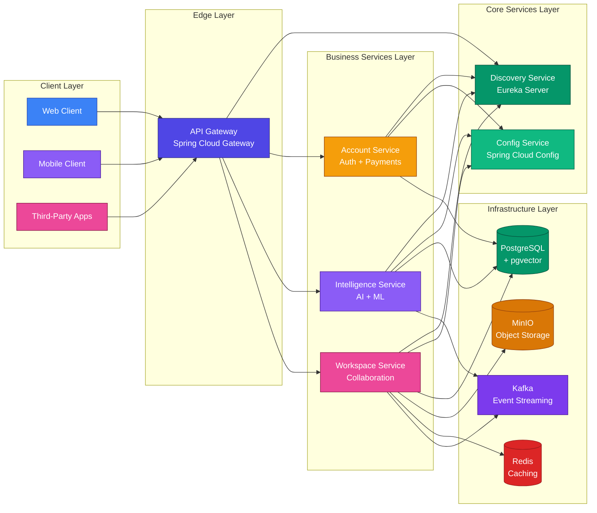

# Distributed Lovable — Microservices Demo

[](https://spring.io/projects/spring-boot)
[](https://spring.io/projects/spring-cloud)
[](https://openjdk.org/)
[](https://www.docker.com/)
[](https://kubernetes.io/)
[](https://maven.apache.org/)
[](LICENSE)

Comprehensive, production-ready Spring Boot microservices architecture with complete infrastructure, tooling, and Kubernetes deployment manifests.

## Table of Contents
- [Introduction](#introduction)
- [Features](#features)
- [Architecture Overview](#architecture-overview)
- [System Architecture Diagram](#system-architecture-diagram)
- [Project Structure](#project-structure)
- [Tech Stack](#tech-stack)
  - [Core Technologies](#core-technologies)
  - [Infrastructure](#infrastructure)
  - [Libraries & Tools](#libraries--tools)
- [Service Details](#service-details)
  - [API Gateway](#api-gateway)
  - [Config Service](#config-service)
  - [Discovery Service](#discovery-service)
  - [Account Service](#account-service)
  - [Intelligence Service](#intelligence-service)
  - [Workspace Service](#workspace-service)
  - [Common Library](#common-library)
- [Prerequisites](#prerequisites)
- [Quickstart (Local Development)](#quickstart-local-development)
  - [1. Clone the Repository](#1-clone-the-repository)
  - [2. Start Infrastructure Services](#2-start-infrastructure-services)
  - [3. Build & Run Services](#3-build--run-services)
- [Infrastructure with Docker Compose](#infrastructure-with-docker-compose)
  - [Services Overview](#services-overview)
  - [Ports & Credentials](#ports--credentials)
  - [Docker Compose Commands](#docker-compose-commands)
- [Kubernetes Deployment](#kubernetes-deployment)
  - [Kubernetes Manifests Structure](#kubernetes-manifests-structure)
  - [Step-by-Step Deployment](#step-by-step-deployment)
- [Building Docker Images](#building-docker-images)
  - [Using Jib](#using-jib)
  - [Image Tags](#image-tags)
- [Development Workflow](#development-workflow)
  - [Building Individual Services](#building-individual-services)
  - [Running Tests](#running-tests)
  - [Debugging](#debugging)
- [Health Checks & Monitoring](#health-checks--monitoring)
  - [Actuator Endpoints](#actuator-endpoints)
  - [Service Health](#service-health)
- [Troubleshooting Guide](#troubleshooting-guide)
- [Useful Commands](#useful-commands)
- [Best Practices](#best-practices)
- [Roadmap & Future Enhancements](#roadmap--future-enhancements)
- [Contributing](#contributing)
- [License](#license)
- [Author](#author)

---

## Introduction

**Distributed Lovable** is a modern, enterprise-grade microservices demo project built with Spring Boot and Spring Cloud. It showcases best practices for building, deploying, and managing distributed systems in both local development and Kubernetes environments.

This project includes:
- Multiple domain-specific microservices
- Service discovery and centralized configuration
- API gateway with routing and security
- AI/ML integration with Spring AI
- Event-driven architecture with Kafka
- Complete Kubernetes manifests for production deployment
- Local development infrastructure with Docker Compose

---

## Features

### Core Microservices Features
- ✅ **API Gateway**: Spring Cloud Gateway with JWT authentication and request routing
- ✅ **Service Discovery**: Eureka Server for dynamic service registration and discovery
- ✅ **Centralized Configuration**: Spring Cloud Config Server for externalized configuration
- ✅ **Domain Services**: Account, Intelligence, and Workspace services with business logic
- ✅ **Shared Library**: Reusable DTOs, exceptions, security utilities, and more

### Infrastructure & DevOps
- ✅ **Docker Compose**: Local development environment with all stateful services
- ✅ **Kubernetes Manifests**: Complete production-ready k8s deployment files
- ✅ **Containerization**: Optimized Docker images built with Jib
- ✅ **Stateful Services**: PostgreSQL (pgvector), MinIO, Kafka, Redis
- ✅ **Network Policies**: Kubernetes network policies for security

### Data & Storage
- ✅ **Relational Database**: PostgreSQL with JPA/Hibernate ORM
- ✅ **Vector Database**: pgvector extension for AI embeddings
- ✅ **Object Storage**: MinIO for file and media storage
- ✅ **Caching**: Redis for performance optimization
- ✅ **Event Streaming**: Apache Kafka for async communication

### AI & Machine Learning
- ✅ **Spring AI Integration**: OpenAI model support
- ✅ **Embeddings Storage**: pgvector for efficient similarity search
- ✅ **Intelligence Service**: AI-powered features and capabilities

### Security & Authentication
- ✅ **JWT Authentication**: JSON Web Token-based security
- ✅ **Spring Security**: Robust security configuration
- ✅ **API Gateway Security**: Centralized security at the edge

### Development & Tooling
- ✅ **Maven Wrapper**: Consistent builds across environments
- ✅ **MapStruct**: Type-safe object mapping
- ✅ **Lombok**: Reduced boilerplate code
- ✅ **Actuator**: Production-ready monitoring and management
- ✅ **Fabric8 Kubernetes Client**: Programmatic K8s interaction

---

## Architecture Overview

The system follows a **layered microservices architecture** with the following key components:

1. **Edge Layer**: API Gateway for routing and security
2. **Core Services Layer**: Config and Discovery services
3. **Business Services Layer**: Domain-specific microservices
4. **Infrastructure Layer**: Databases, messaging, storage, and caching

All services communicate via REST APIs and/or Kafka events, and register with the Eureka Discovery Server for dynamic service discovery.

---

## System Architecture Diagram



---

## Project Structure

```
distributed-lovable/
├── .github/                      # GitHub workflows and CI/CD configuration
├── .idea/                        # IntelliJ IDEA project configuration
├── .vscode/                      # VS Code project configuration
│
├── account-service/              # Account domain microservice
│   ├── src/
│   │   ├── main/
│   │   │   ├── java/             # Java source code
│   │   │   └── resources/        # Configuration files
│   │   └── test/                 # Test code
│   ├── pom.xml                   # Maven configuration
│   ├── mvnw / mvnw.cmd          # Maven wrapper scripts
│   └── HELP.md                   # Service-specific documentation
│
├── api-gateway/                  # API Gateway (Spring Cloud Gateway)
│   ├── src/
│   │   ├── main/
│   │   │   ├── java/
│   │   │   └── resources/
│   │   └── test/
│   ├── pom.xml
│   └── mvnw / mvnw.cmd
│
├── common-lib/                   # Shared library for all services
│   ├── src/
│   │   └── main/
│   │       ├── java/
│   │       │   └── com/adnanumar/distributed_lovable/common_lib/
│   │       │       ├── dto/      # Data Transfer Objects
│   │       │       ├── enums/    # Enumerations
│   │       │       ├── error/    # Exception handling
│   │       │       ├── event/    # Event classes
│   │       │       └── security/ # Security utilities
│   │       └── resources/
│   └── pom.xml
│
├── config-service/               # Centralized configuration server
│   ├── src/
│   ├── pom.xml
│   └── mvnw / mvnw.cmd
│
├── discovery-service/            # Eureka service discovery server
│   ├── src/
│   ├── pom.xml
│   └── mvnw / mvnw.cmd
│
├── intelligence-service/         # AI/ML intelligence service
│   ├── src/
│   ├── pom.xml
│   └── mvnw / mvnw.cmd
│
├── workspace-service/            # Workspace and collaboration service
│   ├── src/
│   ├── pom.xml
│   └── mvnw / mvnw.cmd
│
├── k8s/                          # Kubernetes deployment manifests
│   ├── infra/                    # Infrastructure components
│   │   ├── namespaces.yaml       # Kubernetes namespaces
│   │   ├── core-network-policies.yaml
│   │   ├── preview-network-policies.yaml
│   │   ├── core-dns-policy.yaml
│   │   ├── ingress.yaml
│   │   └── runner-pool.yaml
│   ├── stateful/                 # Stateful services
│   │   ├── pgvector.yaml         # PostgreSQL + pgvector
│   │   ├── minio.yaml            # MinIO object storage
│   │   ├── kafka.yaml            # Kafka event streaming
│   │   └── redis.yaml            # Redis caching
│   ├── services/                 # Application services
│   │   ├── account-service.yaml
│   │   ├── api-gateway.yaml
│   │   ├── config-service.yaml
│   │   ├── intelligence-service.yaml
│   │   └── workspace-service.yaml
│   └── proxy/                    # Preview proxy (Node.js)
│       ├── index.js
│       ├── package.json
│       ├── Dockerfile
│       └── proxy-deployment.yaml
│
├── .gitignore                    # Git ignore rules
├── services.docker-compose.yml   # Local infrastructure (Docker Compose)
└── README.md                     # This file
```

---

## Tech Stack

### Core Technologies
| Component | Technology | Version |
|-----------|------------|---------|
| **Framework** | Spring Boot | 4.0.5 |
| **Cloud Platform** | Spring Cloud | 2025.1.1 |
| **AI Framework** | Spring AI | 2.0.0-M4 |
| **Programming Language** | Java | 21 |
| **Build Tool** | Maven | Wrapper Included |

### Infrastructure
| Component | Technology | Version |
|-----------|------------|---------|
| **Relational Database** | PostgreSQL + pgvector | Latest |
| **Object Storage** | MinIO | Latest |
| **Event Streaming** | Apache Kafka | Latest |
| **Caching** | Redis | Latest |
| **Container Runtime** | Docker | Latest |
| **Orchestration** | Kubernetes | Manifests Included |

### Libraries & Tools
| Library | Purpose | Version |
|---------|---------|---------|
| **Spring Data JPA** | ORM and data access | Spring Boot |
| **Spring Security** | Security and authentication | Spring Boot |
| **Spring Cloud Gateway** | API gateway routing | Spring Cloud |
| **Spring Cloud Config** | Centralized configuration | Spring Cloud |
| **Spring Cloud Netflix Eureka** | Service discovery | Spring Cloud |
| **Spring AI OpenAI** | AI model integration | 2.0.0-M4 |
| **Spring Kafka** | Kafka integration | Spring Boot |
| **Spring Data Redis** | Redis integration | Spring Boot |
| **Lombok** | Reduce boilerplate | Latest |
| **MapStruct** | Object mapping | 1.6.3 |
| **JJWT** | JWT handling | 0.13.0 |
| **Stripe Java** | Payment processing | 31.2.0 |
| **MinIO Java Client** | Object storage client | 8.6.0 |
| **Fabric8 Kubernetes Client** | Kubernetes API client | 7.3.1 |
| **Jib Maven Plugin** | Container image building | 3.4.4 |

---

## Service Details

### API Gateway
- **Purpose**: Single entry point for all client requests; handles routing, security, and cross-cutting concerns
- **Technology**: Spring Cloud Gateway (WebFlux)
- **Key Features**:
  - Request routing to backend services
  - JWT authentication and validation
  - Rate limiting
  - Load balancing
  - Request/response transformation
- **Dependencies**: Spring Cloud Config Client, Eureka Client, JJWT

### Config Service
- **Purpose**: Centralized configuration server for all microservices
- **Technology**: Spring Cloud Config Server
- **Key Features**:
  - Externalized configuration management
  - Support for Git-backed repositories
  - Dynamic configuration updates
  - Environment-specific profiles
- **Dependencies**: Spring Cloud Config Server, Eureka Client

### Discovery Service
- **Purpose**: Service registry for dynamic service registration and discovery
- **Technology**: Spring Cloud Netflix Eureka Server
- **Key Features**:
  - Service registration and discovery
  - Health check monitoring
  - Load balancing integration
- **Dependencies**: Spring Cloud Netflix Eureka Server

### Account Service
- **Purpose**: Manages user accounts, authentication, and payments
- **Technology**: Spring Boot, Spring Data JPA, Spring Security
- **Key Features**:
  - User registration and authentication
  - Account management
  - Payment processing with Stripe
  - Role-based access control
- **Dependencies**: Spring Data JPA, Spring Security, Stripe, MapStruct, PostgreSQL, Eureka Client, Config Client, Common Library

### Intelligence Service
- **Purpose**: Provides AI/ML-powered features and capabilities
- **Technology**: Spring Boot, Spring AI, Spring Data JPA
- **Key Features**:
  - OpenAI model integration
  - AI embeddings generation and storage (pgvector)
  - Event-driven processing with Kafka
  - AI-powered recommendations and analysis
- **Dependencies**: Spring AI OpenAI, Spring Data JPA, PostgreSQL, Kafka, Eureka Client, Config Client, Common Library

### Workspace Service
- **Purpose**: Manages collaborative workspaces, projects, and file storage
- **Technology**: Spring Boot, Spring Data JPA, MinIO, Redis
- **Key Features**:
  - Workspace and project management
  - File storage with MinIO
  - Caching with Redis
  - Kubernetes integration (Fabric8 client)
  - Event-driven with Kafka
- **Dependencies**: Spring Data JPA, MinIO Client, Redis, Fabric8 Kubernetes Client, Kafka, Eureka Client, Config Client, Common Library

### Common Library
- **Purpose**: Reusable code shared across all microservices
- **Key Components**:
  - **DTOs**: Data Transfer Objects for inter-service communication
  - **Enums**: Shared enumerations
  - **Error Handling**: Global exception handler, custom exceptions
  - **Security**: JWT utilities, authentication filters
  - **Events**: Event classes for Kafka messaging
- **Dependencies**: Spring Web, Spring Security, Spring Cloud OpenFeign, JJWT, Lombok

---

## Prerequisites

Before you begin, ensure you have the following installed:

| Prerequisite | Version | Description | Installation Link |
|--------------|---------|-------------|-------------------|
| **JDK** | 21 or higher | Java Development Kit | [Adoptium OpenJDK](https://adoptium.net/) |
| **Maven** | 3.8+ (or use wrapper) | Build automation tool | [Maven Download](https://maven.apache.org/download.cgi) |
| **Docker** | 24.0+ | Container runtime | [Docker Desktop](https://www.docker.com/get-started) |
| **Docker Compose** | 2.20+ | Orchestration tool | Included with Docker Desktop |
| **kubectl** | 1.28+ | Kubernetes CLI | [kubectl Install](https://kubernetes.io/docs/tasks/tools/) |
| **kind/minikube** (optional) | Latest | Local Kubernetes cluster | [kind](https://kind.sigs.k8s.io/) / [minikube](https://minikube.sigs.k8s.io/) |

---

## Quickstart (Local Development)

### 1. Clone the Repository
```bash
git clone https://github.com/your-username/distributed-lovable.git
cd distributed-lovable
```

### 2. Start Infrastructure Services
First, start all stateful services using Docker Compose:

```bash
docker compose -f services.docker-compose.yml up -d
```

This will start:
- PostgreSQL with pgvector
- MinIO object storage
- Apache Kafka
- Redis

### 3. Build & Run Services

#### Start Core Services First
```bash
# Config Service (must start first)
cd config-service
./mvnw clean package
java -jar target/*-SNAPSHOT.jar

# In a new terminal, start Discovery Service
cd ../discovery-service
./mvnw clean package
java -jar target/*-SNAPSHOT.jar
```

#### Start Business Services
```bash
# Account Service
cd ../account-service
./mvnw clean package
java -jar target/*-SNAPSHOT.jar

# Intelligence Service
cd ../intelligence-service
./mvnw clean package
java -jar target/*-SNAPSHOT.jar

# Workspace Service
cd ../workspace-service
./mvnw clean package
java -jar target/*-SNAPSHOT.jar
```

#### Start API Gateway
```bash
cd ../api-gateway
./mvnw clean package
java -jar target/*-SNAPSHOT.jar
```

---

## Infrastructure with Docker Compose

### Services Overview
The `services.docker-compose.yml` file defines all the stateful services needed for local development:

| Service | Image | Purpose |
|---------|-------|---------|
| **PostgreSQL** | `pgvector/pgvector` | Relational database with vector extension |
| **MinIO** | `minio/minio` | Object storage for files and media |
| **Kafka** | `confluentinc/cp-kafka` | Event streaming platform |
| **ZooKeeper** | `confluentinc/cp-zookeeper` | Kafka coordination service |
| **Redis** | `redis` | In-memory data structure store for caching |

### Ports & Credentials

#### PostgreSQL (pgvector)
- **Host**: `localhost`
- **Port**: `9010` (maps to container `5432`)
- **Database**: `pgvector-test`
- **Username**: `user`
- **Password**: `password`
- **JDBC URL**: `jdbc:postgresql://localhost:9010/pgvector-test`

#### MinIO
- **Console UI**: `http://localhost:9001`
- **API Endpoint**: `http://localhost:9000`
- **Access Key**: `minioadmin`
- **Secret Key**: `minioadmin123`

#### Kafka
- **Internal Listener**: `localhost:9092`
- **External Listener**: `localhost:29092`
- **ZooKeeper**: `localhost:2181`

#### Redis
- **Host**: `localhost`
- **Port**: `6379`

### Docker Compose Commands

| Command | Description |
|---------|-------------|
| `docker compose -f services.docker-compose.yml up -d` | Start all services in detached mode |
| `docker compose -f services.docker-compose.yml logs -f` | Follow logs from all services |
| `docker compose -f services.docker-compose.yml logs -f [service-name]` | Follow logs from a specific service |
| `docker compose -f services.docker-compose.yml stop` | Stop all services |
| `docker compose -f services.docker-compose.yml down` | Stop and remove all containers |
| `docker compose -f services.docker-compose.yml down -v` | Stop, remove containers, and delete volumes |

---

## Kubernetes Deployment

### Kubernetes Manifests Structure
All Kubernetes deployment files are organized in the `k8s/` directory:

```
k8s/
├── infra/          # Infrastructure components
│   ├── namespaces.yaml
│   ├── core-network-policies.yaml
│   ├── preview-network-policies.yaml
│   ├── core-dns-policy.yaml
│   ├── ingress.yaml
│   └── runner-pool.yaml
├── stateful/       # Stateful services (databases, storage, etc.)
│   ├── pgvector.yaml
│   ├── minio.yaml
│   ├── kafka.yaml
│   └── redis.yaml
├── services/       # Application microservices
│   ├── account-service.yaml
│   ├── api-gateway.yaml
│   ├── config-service.yaml
│   ├── intelligence-service.yaml
│   └── workspace-service.yaml
└── proxy/          # Preview proxy
    ├── index.js
    ├── package.json
    ├── Dockerfile
    └── proxy-deployment.yaml
```

### Step-by-Step Deployment

#### 1. Prepare Your Kubernetes Cluster
Ensure you have a Kubernetes cluster running. You can use:
- **kind**: Local Kubernetes cluster using Docker containers
- **minikube**: Local Kubernetes cluster
- **Managed Kubernetes**: EKS, GKE, AKS, etc.

#### 2. Create Namespaces
```bash
kubectl apply -f k8s/infra/namespaces.yaml
```

#### 3. Deploy Infrastructure Components
```bash
kubectl apply -f k8s/infra/
```

#### 4. Deploy Stateful Services
```bash
kubectl apply -f k8s/stateful/
```

#### 5. Deploy Application Services
```bash
kubectl apply -f k8s/services/
```

#### 6. Verify Deployment
Check the status of all resources:
```bash
kubectl get all -A
```

Check pods in a specific namespace:
```bash
kubectl get pods -n lovable
```

View logs from a pod:
```bash
kubectl logs -f deployment/account-service -n lovable
```

---

## Building Docker Images

### Using Jib
The project uses **Jib Maven Plugin** to build optimized Docker images without requiring a Dockerfile.

#### Build Image for a Single Service
```bash
cd account-service
./mvnw -DskipTests package jib:dockerBuild
```

#### Build Image Without Docker Daemon
If you want to build an image without a local Docker daemon (e.g., in CI/CD), you can push directly to a registry:
```bash
./mvnw -DskipTests package jib:build
```

### Image Tags
Images are tagged with the following pattern:
```
docker.io/nouman886/lovable-${project.artifactId}:${project.version}
```

For example:
- `docker.io/nouman886/lovable-account-service:0.0.1-SNAPSHOT`
- `docker.io/nouman886/lovable-api-gateway:0.0.1-SNAPSHOT`

All images are also tagged with `latest`.

---

## Development Workflow

### Building Individual Services
Each service has its own Maven wrapper for consistent builds:

```bash
cd [service-directory]

# Clean and build
./mvnw clean package

# Clean, build, and skip tests
./mvnw clean package -DskipTests

# Build without running integration tests
./mvnw clean package -DskipITs
```

### Running Tests
Each module contains unit and integration tests:

```bash
# Run all tests
./mvnw test

# Run a specific test class
./mvnw test -Dtest=YourTestClass

# Run tests with coverage (if configured)
./mvnw test jacoco:report
```

### Debugging
To debug a service locally, start it with debug flags:

```bash
java -jar -Xdebug -Xrunjdwp:transport=dt_socket,server=y,suspend=n,address=5005 target/*-SNAPSHOT.jar
```

Then connect your IDE to port `5005` for remote debugging.

---

## Health Checks & Monitoring

### Actuator Endpoints
Most services expose Spring Boot Actuator endpoints for monitoring and management:

| Endpoint | Purpose |
|----------|---------|
| `/actuator/health` | Service health status |
| `/actuator/info` | Service information |
| `/actuator/metrics` | Application metrics |
| `/actuator/env` | Environment properties |
| `/actuator/loggers` | Logging configuration |

### Service Health
Check the health of a running service:
```bash
curl http://localhost:[service-port]/actuator/health
```

Expected response for a healthy service:
```json
{
  "status": "UP"
}
```

---

## Troubleshooting Guide

### Common Issues & Solutions

#### Service Fails to Connect to Config Server
- **Symptom**: Service startup fails with "Could not connect to Config Server"
- **Solution**: Ensure config-service is running and accessible at the configured URL

#### Service Fails to Register with Eureka
- **Symptom**: Service not visible in Eureka dashboard
- **Solution**: Check discovery-service is running and Eureka client configuration is correct

#### Database Connection Errors
- **Symptom**: "Connection refused" or "Authentication failed"
- **Solution**: 
  - Verify PostgreSQL is running: `docker ps`
  - Check credentials in application configuration
  - Ensure port mapping is correct (9010 → 5432)

#### Kafka Connection Issues
- **Symptom**: "TimeoutException" or "Leader not available"
- **Solution**:
  - Verify Kafka and ZooKeeper are running
  - Check bootstrap servers configuration
  - Ensure topic exists or auto-create is enabled

#### MinIO Access Errors
- **Symptom**: "Access Denied" or "Connection refused"
- **Solution**:
  - Verify MinIO is running and accessible at http://localhost:9000
  - Check access key and secret key
  - Ensure bucket exists

### Log Inspection
Check service logs for detailed error messages:

```bash
# Docker Compose logs
docker compose -f services.docker-compose.yml logs -f [service-name]

# Kubernetes logs
kubectl logs -f deployment/[service-name] -n lovable
```

---

## Useful Commands

### Maven Commands
| Command | Description |
|---------|-------------|
| `./mvnw clean` | Clean build artifacts |
| `./mvnw compile` | Compile source code |
| `./mvnw test` | Run tests |
| `./mvnw package` | Package application |
| `./mvnw install` | Install to local repository |
| `./mvnw dependency:tree` | Show dependency tree |

### Docker Commands
| Command | Description |
|---------|-------------|
| `docker ps` | List running containers |
| `docker ps -a` | List all containers |
| `docker images` | List Docker images |
| `docker logs [container-id]` | View container logs |
| `docker exec -it [container-id] bash` | Execute shell in container |
| `docker system prune -a` | Clean up unused Docker resources |

### Docker Compose Commands
| Command | Description |
|---------|-------------|
| `docker compose up -d` | Start services |
| `docker compose down` | Stop and remove services |
| `docker compose logs -f` | Follow logs |
| `docker compose restart` | Restart services |
| `docker compose pull` | Pull latest images |

### Kubernetes Commands
| Command | Description |
|---------|-------------|
| `kubectl get all -A` | List all resources in all namespaces |
| `kubectl get pods -n [namespace]` | List pods in namespace |
| `kubectl get services -n [namespace]` | List services in namespace |
| `kubectl describe pod [pod-name] -n [namespace]` | Describe pod details |
| `kubectl logs -f [pod-name] -n [namespace]` | Follow pod logs |
| `kubectl exec -it [pod-name] -n [namespace] -- bash` | Exec into pod |
| `kubectl apply -f [file.yaml]` | Apply manifest |
| `kubectl delete -f [file.yaml]` | Delete manifest resources |

---

## Best Practices

### Development Best Practices
1. **Use Maven Wrapper**: Always use `./mvnw` instead of system Maven for consistent builds
2. **Follow Service Startup Order**: Start config → discovery → business services → gateway
3. **Write Tests**: Maintain good test coverage for all services
4. **Use Environment Variables**: Never hardcode secrets or environment-specific configs
5. **Log Effectively**: Use appropriate log levels and structured logging

### Microservices Best Practices
1. **Single Responsibility**: Each service should have one clear purpose
2. **Loose Coupling**: Services should communicate via APIs, not direct dependencies
3. **High Cohesion**: Related functionality should be in the same service
4. **Independent Deployment**: Each service should be deployable independently
5. **Fault Tolerance**: Implement retries, circuit breakers, and fallbacks
6. **API First**: Design APIs before implementation

### Security Best Practices
1. **Never Commit Secrets**: Use environment variables or secret managers
2. **Use HTTPS**: Always use TLS for communication
3. **Validate Inputs**: Sanitize and validate all user inputs
4. **Principle of Least Privilege**: Grant minimal necessary permissions
5. **Keep Dependencies Updated**: Regularly update dependencies for security patches

---

## Roadmap & Future Enhancements

- [ ] Add CI/CD pipeline with GitHub Actions
- [ ] Implement distributed tracing with Sleuth and Zipkin
- [ ] Add circuit breakers with Resilience4j
- [ ] Implement API documentation with Swagger/OpenAPI
- [ ] Add integration tests with Testcontainers
- [ ] Implement health checks and self-healing in Kubernetes
- [ ] Add monitoring with Prometheus and Grafana
- [ ] Implement log aggregation with ELK stack (Elasticsearch, Logstash, Kibana)
- [ ] Add Helm charts for Kubernetes deployment
- [ ] Implement feature flags
- [ ] Add rate limiting and throttling
- [ ] Implement multi-environment support (dev, staging, prod)

---

## Contributing

Contributions are welcome! Please feel free to submit a Pull Request.

1. Fork the repository
2. Create your feature branch (`git checkout -b feature/AmazingFeature`)
3. Commit your changes (`git commit -m 'Add some AmazingFeature'`)
4. Push to the branch (`git push origin feature/AmazingFeature`)
5. Open a Pull Request

---

## License

This project is licensed under the MIT License - see the [LICENSE](LICENSE) file for details.

---

## Author

**Adnan Umar**

---

*Generated on May 25, 2026*

