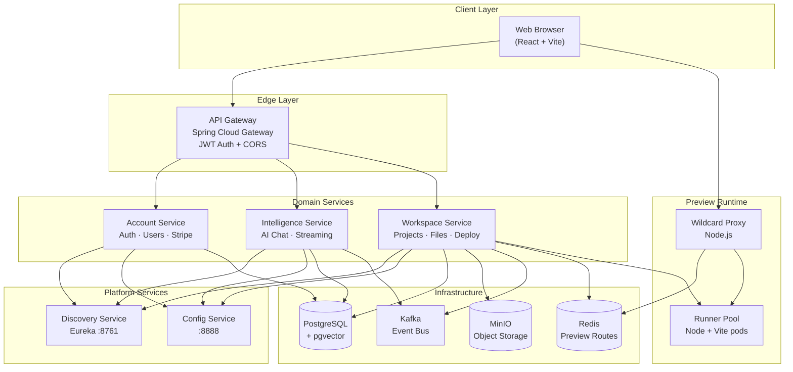
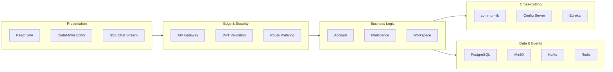
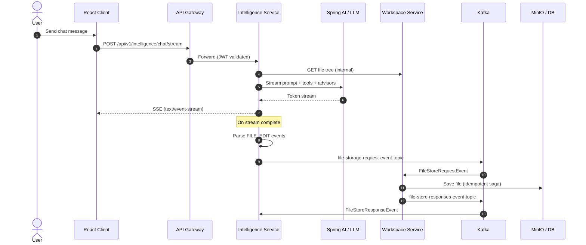
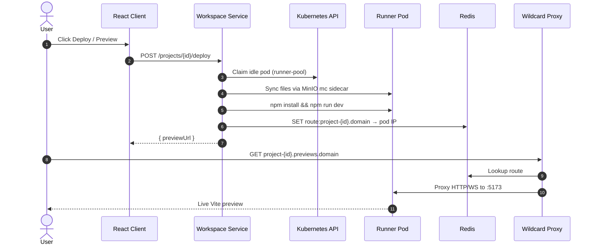
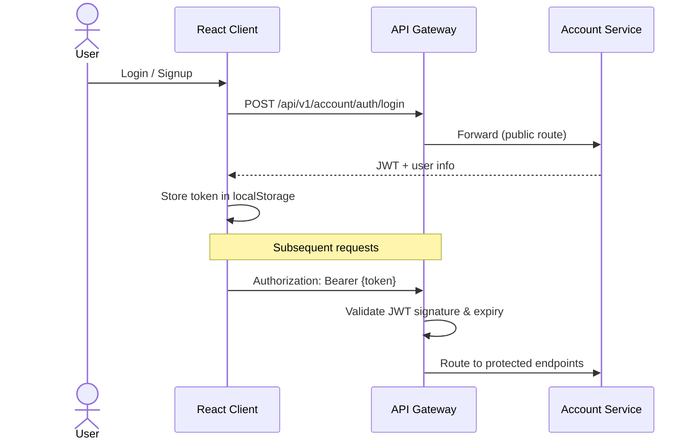
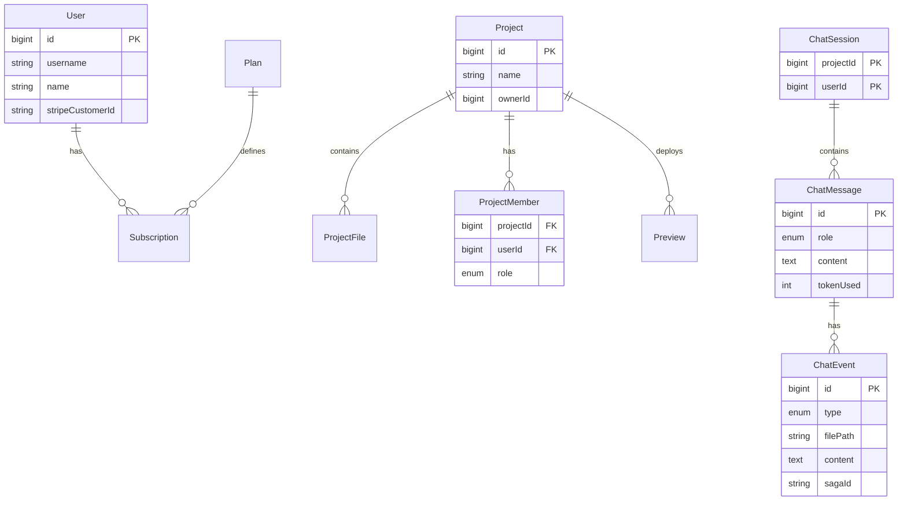

<div align="center">

# Distributed Lovable

**An AI-powered, full-stack platform for building web apps through conversation — with live preview, collaborative workspaces, event-driven architecture powered by Kafka, real-time SSE streaming, and a cloud-native microservices backend.**

[](https://spring.io/projects/spring-boot)
[](https://spring.io/projects/spring-cloud)
[](https://openjdk.org/)
[](https://react.dev/)
[](https://www.typescriptlang.org/)
[](https://kubernetes.io/)
[](https://www.docker.com/)
[](https://kafka.apache.org/)
[](https://www.postgresql.org/)
[](https://redis.io/)
[](https://min.io/)
[](https://spring.io/projects/spring-ai)
[](https://stripe.com/)

</div>

---

## Table of Contents

- [Overview](#overview)
- [Key Features](#key-features)
- [Tech Stack](#tech-stack)
- [Repository Layout](#repository-layout)
- [System Architecture](#system-architecture)
- [Request & Data Flows](#request--data-flows)
- [Backend Services](#backend-services)
- [Frontend Application](#frontend-application)
- [Shared Library (`common-lib`)](#shared-library-common-lib)
- [API Reference](#api-reference)
- [Infrastructure](#infrastructure)
- [Kubernetes Deployment](#kubernetes-deployment)
- [Local Development](#local-development)
- [Environment Variables](#environment-variables)
- [Project Conventions](#project-conventions)

---

## Overview

**Distributed Lovable** is a monorepo that delivers a Lovable-style developer experience: users describe what they want in natural language, an AI assistant generates and edits project files, and the result is previewed live in the browser. The platform is built for scale with a **React + Vite** frontend and a **Spring Boot microservices** backend orchestrated through an API gateway, service discovery, and centralized configuration.

The repository is organized around two primary roots:

| Path | Purpose |
|------|---------|
| [`client/`](client/) | Browser UI — chat, code editor, file tree, live preview |
| [`server/`](server/) | Microservices, shared library, Docker Compose, and Kubernetes manifests |

---

## Key Features

| Area | Capabilities |
|------|-------------|
| **AI Code Generation** | Streaming chat with Spring AI, file-tree context, and tool-assisted file reads |
| **Project Workspace** | CRUD projects, file storage (MinIO), member invites, role-based access (Owner / Editor / Viewer) |
| **Live Preview** | Kubernetes runner pool + Redis-routed wildcard proxy for per-project preview URLs |
| **Authentication** | JWT-based auth via API gateway; signup/login flows |
| **Billing** | Stripe integration for subscriptions, checkout, and customer portal |
| **Event-Driven Storage** | Kafka saga for durable AI-generated file writes with idempotency |
| **Cloud Native** | Eureka discovery, Spring Cloud Config, K8s deployments, network policies |

---

## Tech Stack

### Frontend (`client/`)

| Layer | Technology |
|-------|------------|
| Framework | React 18, TypeScript 5.8 |
| Build | Vite 5, SWC |
| Routing | React Router 6 |
| State / Data | TanStack React Query |
| Styling | Tailwind CSS 3, shadcn/ui (Radix primitives) |
| Code Editor | CodeMirror 6 (`@uiw/react-codemirror`) |
| Layout | react-resizable-panels |
| Markdown | react-markdown, remark-gfm |
| Testing | Vitest, Testing Library |

### Backend (`server/`)

| Layer | Technology |
|-------|------------|
| Runtime | Java 21 |
| Framework | Spring Boot 4.0.5, Spring Cloud 2025.1.1 |
| AI | Spring AI 2.0.0-M4 (`ChatClient`, tools, advisors) |
| Gateway | Spring Cloud Gateway (reactive) |
| Discovery | Netflix Eureka |
| Config | Spring Cloud Config Server (Git-backed) |
| Persistence | Spring Data JPA, PostgreSQL + pgvector |
| Object Storage | MinIO |
| Messaging | Apache Kafka (Confluent) |
| Caching / Routing | Redis |
| K8s Client | Fabric8 Kubernetes Client |
| Payments | Stripe Java SDK |
| Mapping | MapStruct, Lombok |

---

## Repository Layout

```text
distributed-lovable/
│
├── client/                              # Frontend (Vite + React)
│   ├── public/                          # Static assets, error-catcher.js
│   ├── src/
│   │   ├── components/                  # Feature & UI components
│   │   │   ├── ui/                      # shadcn design-system primitives (40+)
│   │   │   ├── ChatPanel.tsx            # AI chat interface
│   │   │   ├── ChatEventRenderer.tsx    # Renders THOUGHT / FILE_EDIT events
│   │   │   ├── CodeEditor.tsx           # CodeMirror wrapper
│   │   │   ├── CodePanel.tsx            # Editor + file tabs layout
│   │   │   ├── FileTree.tsx             # Project file explorer
│   │   │   ├── FileTabs.tsx             # Open file tab bar
│   │   │   ├── PreviewPanel.tsx         # iframe live preview
│   │   │   ├── ShareDialog.tsx          # Member invite & roles
│   │   │   ├── LoginModal.tsx           # Auth modal
│   │   │   └── RuntimeErrorAlert.tsx    # Preview runtime errors
│   │   ├── hooks/                       # use-stream-parser, use-mobile, use-toast
│   │   ├── lib/                         # api.ts, types.ts, utils.ts
│   │   ├── pages/                       # Route-level views
│   │   │   ├── Index.tsx                # Auth redirect hub
│   │   │   ├── LoginModal route         # /login
│   │   │   ├── Signup.tsx               # /signup
│   │   │   ├── ProjectsDashboard.tsx    # /projects
│   │   │   ├── ProjectView.tsx          # /projects/:projectId
│   │   │   └── NotFound.tsx
│   │   ├── test/                        # Vitest setup & examples
│   │   ├── App.tsx                      # Router + providers
│   │   └── main.tsx                     # Entry point
│   ├── Dockerfile                       # Multi-stage NGINX production build
│   ├── package.json
│   ├── vite.config.ts
│   ├── tailwind.config.ts
│   └── vitest.config.ts
│
├── server/                              # Backend microservices
│   ├── account-service/                 # Auth, users, Stripe billing
│   ├── api-gateway/                     # Edge routing + JWT validation
│   ├── common-lib/                      # Shared DTOs, security, events, errors
│   ├── config-service/                  # Spring Cloud Config (port 8888)
│   ├── discovery-service/               # Eureka server (port 8761)
│   ├── intelligence-service/            # AI chat, streaming, Kafka producer
│   ├── workspace-service/               # Projects, files, members, K8s deploy
│   ├── k8s/                             # Kubernetes manifests
│   │   ├── infra/                       # Namespaces, ingress, network policies, runner pool
│   │   ├── services/                    # Microservice deployments
│   │   ├── stateful/                    # PostgreSQL, MinIO, Kafka, Redis
│   │   └── proxy/                       # Wildcard preview proxy (Node.js)
│   └── services.docker-compose.yml      # Local infrastructure stack
│
├── .gitignore
└── README.md
```

---

## System Architecture

The platform follows a classic **microservices + API gateway** pattern. Clients never talk to individual services directly — all traffic flows through the gateway, which validates JWTs and routes to the correct downstream service via Eureka service discovery.



### Layer Responsibilities



---

## Request & Data Flows

### AI Chat → File Storage Saga

When a user sends a chat message, the intelligence service streams an LLM response. Parsed `FILE_EDIT` events are published to Kafka; the workspace service persists files to MinIO/DB and acknowledges via a response topic.



### Live Preview Deployment

Deploy claims an idle runner pod from the pool, syncs project files from MinIO, starts Vite, and registers the hostname → pod mapping in Redis for the wildcard proxy.



### Authentication Flow



---

## Backend Services

### Service Map

| Service | Port (local) | Database | Key Integrations |
|---------|-------------|----------|------------------|
| **config-service** | 8888 | — | Git config repo |
| **discovery-service** | 8761 | — | Eureka registry |
| **api-gateway** | (from config) | — | JWT, CORS, routing |
| **account-service** | (from config) | PostgreSQL | Stripe, JWT issuance |
| **intelligence-service** | (from config) | PostgreSQL | Spring AI, Kafka, Workspace client |
| **workspace-service** | (from config) | PostgreSQL | MinIO, Kafka, Redis, Fabric8 K8s |

> Service ports and routes are externalized to the [config server repository](https://github.com/Adnan-Umar/distributed-lovable-config-server) and loaded at startup via `spring.config.import`.

### `account-service`

Handles identity, authentication, and monetization.

```
account-service/src/main/java/.../
├── controller/
│   ├── AuthController.java          # /auth/signup, /auth/login
│   ├── BillingController.java       # Subscriptions, Stripe checkout/portal/webhooks
│   └── InternalAccountController.java  # /internal/v1/users, billing
├── entity/
│   ├── User.java
│   ├── Plan.java
│   └── Subscription.java
├── service/impl/
│   ├── AuthServiceImpl.java
│   └── SubscriptionServiceImpl.java
├── config/PaymentConfig.java        # Stripe SDK setup
└── security/AccountSecurityConfig.java
```

### `api-gateway`

Single entry point for all client traffic.

- **Global JWT filter** — validates Bearer tokens; skips configured public routes
- **CORS configuration** — cross-origin support for the SPA
- **Reactive routing** — load-balanced routes to Eureka-registered services
- Config loaded from config server: `configserver:${CONFIG_SERVER_URL:http://localhost:8888}`

### `intelligence-service`

AI brain of the platform.

```
intelligence-service/src/main/java/.../
├── controller/ChatController.java       # SSE streaming + history
├── service/impl/
│   ├── AiGenerationServiceImpl.java     # ChatClient orchestration
│   └── ChatServiceImpl.java
├── llm/
│   ├── tools/CodeGenerationTools.java   # @Tool read_files
│   ├── advisors/FileTreeContextAdvisor.java
│   ├── LlmResponseParser.java           # Parses FILE_EDIT events
│   └── PromptUtils.java
├── consumer/IntelligenceSagaResponseHandler.java
├── entity/                              # ChatSession, ChatMessage, ChatEvent, UsageLog
└── client/WorkspaceClient.java          # Feign-style internal calls
```

**Spring AI pipeline:** system prompt → user message → `FileTreeContextAdvisor` (injects project file tree) → `CodeGenerationTools.read_files` (tool calls) → streamed response → post-process into chat events → Kafka file storage saga.

### `workspace-service`

Owns project lifecycle, collaboration, and preview deployment.

```
workspace-service/src/main/java/.../
├── controller/
│   ├── ProjectController.java           # CRUD + deploy
│   ├── FileController.java              # File tree & content
│   ├── ProjectMemberController.java     # Invite, roles, remove
│   └── InternalWorkspaceController.java # Service-to-service APIs
├── entity/
│   ├── Project.java, ProjectFile.java
│   ├── ProjectMember.java, Preview.java
│   └── ProcessedEvent.java              # Kafka idempotency
├── consumer/FileStorageConsumer.java    # Kafka file write handler
├── service/impl/
│   ├── KubernetesDeploymentServiceImpl.java  # Runner pool + Redis routes
│   ├── ProjectServiceImpl.java
│   └── ProjectFileServiceImpl.java
├── config/
│   ├── StorageConfig.java               # MinIO client
│   └── KubernetesConfig.java            # Fabric8 client
└── security/SecurityExpressions.java   # @PreAuthorize helpers
```

### `discovery-service` & `config-service`

| Service | Role |
|---------|------|
| **discovery-service** | Eureka server on port **8761**; services register for dynamic lookup |
| **config-service** | Git-backed config server on port **8888**; centralizes YAML for all services |

---

## Frontend Application

### Routes

| Path | Component | Description |
|------|-----------|-------------|
| `/` | `Index` | Redirects to `/projects` or `/login` |
| `/login` | `LoginModal` | Username/password authentication |
| `/signup` | `Signup` | New user registration |
| `/projects` | `ProjectsDashboard` | Project list, create, delete |
| `/projects/:projectId` | `ProjectView` | Chat + code + preview workspace |

### Project Workspace Layout

The main editor view (`ProjectView`) uses resizable panels:

```text
┌─────────────────────────────────────────────────────────────┐
│  Header: project name · deploy · share · user menu          │
├──────────────────┬──────────────────────────────────────────┤
│                  │                                          │
│   Chat Panel     │   Code Panel  ↔  Preview Panel           │
│   (AI stream)    │   (FileTree + CodeMirror)  (iframe)      │
│                  │                                          │
└──────────────────┴──────────────────────────────────────────┘
```

### Key Frontend Modules

| Module | File | Responsibility |
|--------|------|----------------|
| API Client | `lib/api.ts` | REST calls, SSE chat stream, auth token management |
| Types | `lib/types.ts` | Shared TypeScript interfaces & enums |
| Stream Parser | `hooks/use-stream-parser.ts` | Parses SSE chunks from AI |
| Chat Events | `components/ChatEventRenderer.tsx` | Renders THOUGHT, MESSAGE, FILE_EDIT, TOOL_LOG |
| Preview | `components/PreviewPanel.tsx` | iframe with runtime error catching |

### API Base URL

Configured via environment variable at build time:

```bash
VITE_API_URL=http://api.lovable.local   # default in Dockerfile
```

All requests are prefixed through the gateway:

```text
/api/v1/account/...        → account-service
/api/v1/workspace/...      → workspace-service
/api/v1/intelligence/...   → intelligence-service
```

---

## Shared Library (`common-lib`)

Reusable backend module consumed by all domain services via Maven dependency.

| Package | Contents |
|---------|----------|
| `dto/` | `UserDto`, `PlanDto`, `FileTreeDto`, `FileNode` |
| `enums/` | `ProjectRole`, `ProjectPermission`, `ChatEventType`, `ChatEventStatus`, `MessageRole`, `SubscriptionStatus`, `PreviewStatus` |
| `event/` | `FileStoreRequestEvent`, `FileStoreResponseEvent` |
| `error/` | `GlobalExceptionHandler`, `ApiError`, `BadRequestException`, `ResourceNotFoundException` |
| `security/` | `JwtAuthFilter`, `JwtUserPrincipal`, `AuthUtil`, auto-configuration |

Auto-registered via `META-INF/spring/org.springframework.boot.autoconfigure.AutoConfiguration.imports`.

---

## API Reference

### Public Routes (via Gateway)

#### Authentication — `account-service`

| Method | Path | Description |
|--------|------|-------------|
| `POST` | `/api/v1/account/auth/signup` | Register new user |
| `POST` | `/api/v1/account/auth/login` | Login, returns JWT |

#### Billing — `account-service`

| Method | Path | Description |
|--------|------|-------------|
| `GET` | `/api/v1/account/api/me/subscription` | Current subscription |
| `POST` | `/api/v1/account/api/payments/checkout` | Stripe checkout session |
| `POST` | `/api/v1/account/api/payments/portal` | Stripe customer portal |
| `POST` | `/api/v1/account/webhooks/payments` | Stripe webhook handler |

#### Projects — `workspace-service`

| Method | Path | Description |
|--------|------|-------------|
| `GET` | `/api/v1/workspace/projects` | List user's projects |
| `POST` | `/api/v1/workspace/projects` | Create project |
| `GET` | `/api/v1/workspace/projects/{id}` | Get project details |
| `PATCH` | `/api/v1/workspace/projects/{id}` | Rename project |
| `DELETE` | `/api/v1/workspace/projects/{id}` | Delete project |
| `POST` | `/api/v1/workspace/projects/{id}/deploy` | Deploy live preview |

#### Files — `workspace-service`

| Method | Path | Description |
|--------|------|-------------|
| `GET` | `/api/v1/workspace/projects/{id}/files` | File tree listing |
| `GET` | `/api/v1/workspace/projects/{id}/files/content?path=` | File content |

#### Members — `workspace-service`

| Method | Path | Description |
|--------|------|-------------|
| `GET` | `/api/v1/workspace/projects/{id}/members` | List members |
| `POST` | `/api/v1/workspace/projects/{id}/members` | Invite member |
| `PATCH` | `/api/v1/workspace/projects/{id}/members/{userId}` | Update role |
| `DELETE` | `/api/v1/workspace/projects/{id}/members/{userId}` | Remove member |

#### AI Chat — `intelligence-service`

| Method | Path | Description |
|--------|------|-------------|
| `POST` | `/api/v1/intelligence/chat/stream` | SSE streaming chat (body: `{ message, projectId }`) |
| `GET` | `/api/v1/intelligence/chat/projects/{projectId}` | Chat history |

### Internal Routes (service-to-service)

| Service | Path | Purpose |
|---------|------|---------|
| account | `/internal/v1/users/{id}` | User lookup |
| account | `/internal/v1/users/by-email` | Email lookup |
| account | `/internal/v1/billing/current-plan` | Plan info |
| workspace | `/internal/v1/projects/{id}/files/tree` | File tree for AI context |
| workspace | `/internal/v1/projects/{id}/files/content` | File content for AI tools |
| workspace | `/internal/v1/projects/{id}/permissions/check` | Permission validation |

---

## Infrastructure

### Local Stack (`services.docker-compose.yml`)

| Service | Image | Host Port | Purpose |
|---------|-------|-----------|---------|
| **pgvector** | `pgvector/pgvector:0.8.1-pg18` | `9010` → 5432 | PostgreSQL + vector extension |
| **minio** | `quay.io/minio/minio:latest` | `9000` (API), `9001` (console) | Object storage |
| **kafka** | `confluentinc/confluent-local:7.5.0` | `9092`, `29092` | Event streaming |

**Default credentials (local only):**

| Service | User | Password |
|---------|------|----------|
| PostgreSQL | `user` | `password` |
| PostgreSQL DB | `pgvector-test` | — |
| MinIO | `minioadmin` | `minioadmin123` |

### Kafka Topics

| Topic | Producer | Consumer | Payload |
|-------|----------|----------|---------|
| `file-storage-request-event-topic` | intelligence-service | workspace-service | `FileStoreRequestEvent` |
| `file-store-responses-event-topic` | workspace-service | intelligence-service | `FileStoreResponseEvent` |

### Data Model (Core Entities)



---

## Kubernetes Deployment

### Namespaces

| Namespace | Purpose |
|-----------|---------|
| `lovable-core` | Microservices, stateful infra, ingress |
| `lovable-previews` | Runner pool pods for live previews |

### Manifest Structure

```text
server/k8s/
├── infra/
│   ├── namespaces.yaml              # lovable-core, lovable-previews + ConfigMap
│   ├── ingress.yaml                 # Frontend, API, wildcard preview routes
│   ├── runner-pool.yaml             # Idle Node.js + MinIO syncer pods
│   ├── core-network-policies.yaml   # Inter-service traffic rules
│   ├── preview-network-policies.yaml
│   └── core-dns-policy.yaml
├── services/
│   ├── api-gateway.yaml
│   ├── account-service.yaml
│   ├── workspace-service.yaml
│   ├── intelligence-service.yaml
│   └── config-service.yaml
├── stateful/
│   ├── pgvector.yaml
│   ├── minio.yaml
│   ├── kafka.yaml
│   └── redis.yaml
└── proxy/
    ├── index.js                     # Redis-backed wildcard reverse proxy
    ├── proxy-deployment.yaml
    ├── Dockerfile
    └── package.json
```

### Ingress Routes

| Host | Backend | Purpose |
|------|---------|---------|
| `lovable.local` / `localhost` | `lovable-frontend:80` | React SPA |
| `api.lovable.local` | `api-gateway:80` | REST + SSE API |
| `*.previews.lovable.local` | `lovable-proxy:80` | Per-project live previews |

### Preview Proxy

The Node.js proxy (`server/k8s/proxy/index.js`) resolves hostnames via Redis keys (`route:{hostname}` → pod IP) and forwards HTTP/WebSocket traffic to Vite dev servers on port 5173.

### Runner Pool

Each preview pod contains two containers:

1. **runner** — `node:20-alpine`, runs Vite dev server
2. **syncer** — `minio/mc`, syncs project files from MinIO into the shared workspace volume

The workspace service claims idle pods, labels them `status=busy`, syncs files, starts the dev server, and registers the route in Redis.

---

## Local Development

### Prerequisites

- **Node.js** 20+
- **Java** 21
- **Docker** & Docker Compose
- **Maven** (or use included `./mvnw` wrappers)

### 1. Start Infrastructure

```bash
cd server
docker compose -f services.docker-compose.yml up -d
```

### 2. Start Backend (recommended order)

```bash
# Terminal 1 — Config Server
cd server/config-service && ./mvnw spring-boot:run

# Terminal 2 — Discovery
cd server/discovery-service && ./mvnw spring-boot:run

# Terminal 3–5 — Domain Services
cd server/account-service && ./mvnw spring-boot:run
cd server/intelligence-service && ./mvnw spring-boot:run
cd server/workspace-service && ./mvnw spring-boot:run

# Terminal 6 — Gateway (start last)
cd server/api-gateway && ./mvnw spring-boot:run
```

> On Windows, use `mvnw.cmd` instead of `./mvnw`.

### 3. Start Frontend

```bash
cd client
npm install
npm run dev
```

The dev server typically runs at `http://localhost:5173`.

### Useful Commands

| Command | Location | Purpose |
|---------|----------|---------|
| `npm run build` | `client/` | Production build |
| `npm run lint` | `client/` | ESLint |
| `npm run test` | `client/` | Vitest |
| `./mvnw test` | any service | Unit tests |
| `docker compose -f services.docker-compose.yml down` | `server/` | Stop infra |

---

## Environment Variables

### Config Service

| Variable | Description |
|----------|-------------|
| `GITHUB_USERNAME` / `GITHUB_PASSWORD` | Git credentials for config repo (local) |
| `GIT_USERNAME` / `GIT_PASSWORD` | Git credentials (k8s profile) |

### API Gateway

| Variable | Default | Description |
|----------|---------|-------------|
| `CONFIG_SERVER_URL` | `http://localhost:8888` | Config server endpoint |

### Frontend (build-time)

| Variable | Default | Description |
|----------|---------|-------------|
| `VITE_API_URL` | `http://api.codingshuttle.in` | API gateway base URL |

### Preview Proxy

| Variable | Default | Description |
|----------|---------|-------------|
| `REDIS_URL` | `redis://localhost:6379` | Redis for route lookups |
| `PORT` | `80` | Proxy listen port |

### Kubernetes ConfigMap (`lovable-shared-config`)

| Key | Example | Description |
|-----|---------|-------------|
| `PREVIEW_DOMAIN` | `previews.adnan.in` | Base domain for preview URLs |
| `PREVIEW_NAMESPACE` | `lovable-previews` | K8s namespace for runners |
| `PROXY_PORT` | `80` | Preview URL port |
| `APP_FRONTEND_URL` | `http://localhost:5173` | Frontend origin |

---

## Project Conventions

| Convention | Detail |
|------------|--------|
| **Package naming** | `com.adnanumar.distributed_lovable.{service}` |
| **API versioning** | Gateway prefixes: `/api/v1/{service}/...` |
| **Auth** | JWT Bearer token in `Authorization` header |
| **Roles** | `OWNER`, `EDITOR`, `VIEWER` on project members |
| **Chat events** | `THOUGHT`, `MESSAGE`, `FILE_EDIT`, `TOOL_LOG` |
| **Idempotency** | Kafka sagas tracked via `ProcessedEvent` + `sagaId` |
| **Config** | Externalized to Git; not committed in service repos |

---

<div align="center">

Built with Spring Boot · Spring Cloud · Spring AI · React · Kubernetes

</div>
